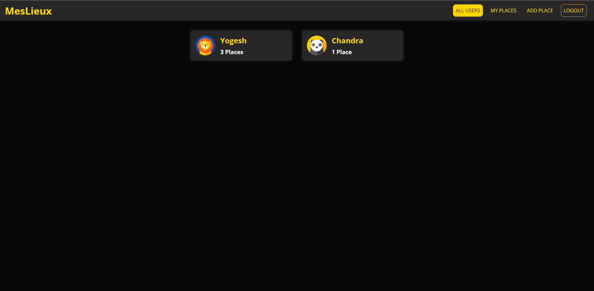

# MesLieux - Travel Photo App
 ---
 <div>
<b>Full-Stack Web Development - MERN Stack</b>
 </div>

## Description
<p>This <b>Single Page Application</b> is designed for users to showcase the pictures of the places they visit. MesLieux is designed to be responsive across all kinds of devices.</p>
<p>Users can create an account and securely login to MesLieux. They can seamlessly browse and discover the places uploaded by other users.</p>
<p>MesLieux allows the user to <b>Create, Edit, and Delete</b> their own places which they want to showcase.</p>
<p>A dynamic Google Map overlay is also provided for every uploaded place, allowing the users to visualise, interact, and explore the location. </p>


### Tech stack
```
Core:
- React
- Node.js
- Express.js
- MongoDB

Other tools used:
- Google Maps Javascript API
- Google Geocoding API
- JSON Web Token (JWT)
```

### Site:
WebApp: https://meslieux.web.app/
API:    https://meslieux-api.onrender.com/

## Preview



